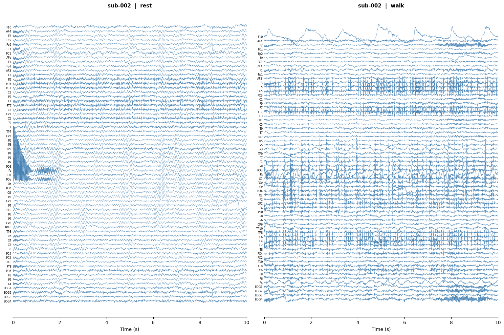

# ParkinsonTSA
GitHub repository for the Fall 2026 STAT 248 final project — time series analysis of Parkinson's disease neuroimaging data.

## Prerequisites

| Requirement | Notes |
|---|---|
| [Anaconda](https://www.anaconda.com/download) or [Miniconda](https://docs.conda.io/en/latest/miniconda.html) | Required for environment creation |
| [Homebrew](https://brew.sh) | macOS only — required to install `git-annex` |

## Dataset

This project uses the OpenNeuro dataset [ds007526](https://openneuro.org/datasets/ds007526).

**The raw dataset is not stored in this repository.** The raw dataset download is skipped By default. To download the full raw dataset from OpenNeuro database, pass the `--download_raw` flag (see Setup section below for full details):

```bash
bash setup.sh --download_raw
```

However, downloading raw dataset and preprocessing them will take a long time. Alternatively, a user can download a zip file containing preprocessed data from this [Google Drive link](https://drive.google.com/file/d/1VNHgcpJ7q9Bxw9rPpVUn8EPbK7DTnDhT/view?usp=sharing). When downloaded, unzip the file in the main directory, and you will find `data_preprocessed` directory containing .h5 files of sampled subjects.

If you downloaded the raw dataset, make sure you create preprocessed data before running `main.ipynb`. See [Generating preprocessed data](#generating-preprocessed-data).

## Setup

Clone the repository and run the setup script from the project root:

```bash
git clone https://github.com/wjung21/ParkinsonTSA.git
cd ParkinsonTSA
bash setup.sh
```

The script will:
1. Verify that `conda` is available
2. *(if `--download_raw`)* Install `git-annex` — via Homebrew on macOS, or conda-forge on Linux
3. *(if `--download_raw`)* Install `datalad` via conda-forge (used to download annexed dataset files)
4. *(if `--download_raw`)* Download the raw dataset into `data/ds007526/`
5. Create a conda environment named `parkinson-tsa` (Python 3.11) with the packages listed below
6. Register the environment as a Jupyter kernel

The script is **idempotent** — re-running it safely skips any step already completed.

## Activating the Environment
Before running Python files and jupyter notebook, activate the python environment.
```bash
conda activate parkinson-tsa
```

## Python Packages

| Category | Packages |
|---|---|
| Core numerics | `numpy`, `pandas`, `scipy`, `xarray` |
| Statistics / ML | `statsmodels`, `scikit-learn` |
| Neuroimaging | `nibabel`, `nilearn`, `mne`, `mne-icalabel` |
| Visualization | `matplotlib`, `seaborn` |
| Utilities | `tqdm`, `onnxruntime` |
| Notebooks | `jupyter`, `ipykernel` |

## Analysis Pipeline

### 1. Participant Selection — Propensity Score Matching (`utils/psm.py`)

Not all participants have both a resting-state and a walking recording. Before any analysis, subjects missing either recording are excluded, and the remaining Healthy Controls (HC) and Parkinson's Disease (PD) participants are balanced using **Propensity Score Matching (PSM)**.

PSM fits a logistic regression to estimate each participant's probability of belonging to the HC group given their covariates (age, sex, MoCA score). Each HC participant is then matched to the most similar PD participant by propensity score distance.

```python
import pandas as pd
from utils.psm import PropensityScoreMatching

df = pd.read_csv("data/ds007526/participants.tsv", sep="\t", na_values="n/a")

psm = PropensityScoreMatching(
    target_col="group",
    features=["age", "sex", "moca"],
    data_dir="data/ds007526",
    required_tasks=["rest", "walk"],   # exclude subjects missing either recording
    caliper=0.2,                        # max allowed propensity score distance
    random_state=42,
)
matched = psm.fit_match(df)
psm.summary()                           # prints SMD before/after matching
```

The returned dataframe contains the matched HC–PD pairs along with all original participant metadata (`participant_id`, `subject_id`, demographic variables, etc.) and two added columns:

| Column | Description |
|---|---|
| `_pscore` | Estimated propensity score |
| `_match_id` | Integer linking each HC to its matched PD partner |

### 2. EEG Loading & Preprocessing (`utils/eeg_loader.py`)

EEG recordings are stored in EEGLAB `.set` format under `data/ds007526/{participant_id}/eeg/`. Each participant has up to two task recordings:

| Task | Filename pattern |
|---|---|
| Resting-state | `{participant_id}_task-rest_eeg.set` |
| Walking | `{participant_id}_task-walk_eeg.set` |

The function `load_preprocess` loads and preprocesses both recordings for a single participant and returns them as [`xarray.DataArray`](https://docs.xarray.dev) objects (shape `channel × time`).

```python
from utils.eeg_loader import load_preprocess

data = load_preprocess("sub-002", data_dir="data/ds007526")
rest = data["rest"]   # xr.DataArray  (65 channels × ~60 000 samples)
walk = data["walk"]
```

#### Preprocessing steps

The following steps are applied to each recording in order:

**1. Electrode positions**
Electrode 3-D positions (CapTrak coordinate system, units: metres) are loaded from the BIDS sidecar `{participant_id}_space-CapTrak_electrodes.tsv` and attached to the raw object as a digitisation montage. This is required for subsequent spherical spline interpolation.

**2. Bad channel marking**
Channels flagged as `"bad"` in the BIDS sidecar `{participant_id}_task-{task}_channels.tsv` are recorded in `raw.info["bads"]`.

**3. Bandpass filtering**
A zero-phase FIR bandpass filter is applied (default: **1–45 Hz**). The high-pass at 1 Hz removes slow drifts and DC offset; the low-pass at 45 Hz retains all classical sensorimotor EEG bands (delta 0.5–4 Hz, theta 4–8 Hz, alpha 8–13 Hz, beta 13–30 Hz) while sitting safely below the 50 Hz power-line frequency, making the filter boundary independent of line noise.

**4. Notch filtering**
A narrow notch filter is applied at **50 Hz** (default) to remove power-line noise. The dataset metadata (`PowerLineFrequency: 50 Hz`, `SoftwareFilters: n/a`) confirms that no hardware filtering was applied during acquisition, making this step necessary. The 100 Hz harmonic is already fully attenuated by the 45 Hz low-pass and does not need a dedicated notch.

**5. Average reference**
The signal is re-referenced to the **common average** of all electrodes, which is the standard reference for source-independent EEG analysis and minimises the spatial bias introduced by any single reference electrode.

**6. Bad channel interpolation**
Channels marked bad in step 2 are reconstructed from their neighbours using **spherical spline interpolation** (MNE default). The interpolated channel names are recorded in `da.attrs["interpolated_bads"]`.

**7. Export to `xarray.DataArray`**
The preprocessed signal is exported to an `xr.DataArray` with:
- **dims** `("channel", "time")` — rows are electrodes, columns are time points
- **`coords["channel"]`** — electrode labels (e.g. `"Fz"`, `"Cz"`)
- **`coords["time"]`** — time in seconds from recording onset
- **`attrs`** — `sfreq`, `l_freq`, `h_freq`, `reference`, `interpolated_bads`, `participant_id`, `task`

`xarray` is chosen over a plain `numpy.ndarray` because channel names and the time axis are retained as named coordinates, enabling label-based selection (`da.sel(channel="Fz")`, `da.sel(time=slice(10, 60))`), while still supporting all NumPy/SciPy operations. The underlying array is always accessible via `da.values`.

#### Preprocessing parameters

| Parameter | Default | Description |
|---|---|---|
| `l_freq` | `1.0` Hz | High-pass cut-off |
| `h_freq` | `45.0` Hz | Low-pass cut-off (below 50 Hz line noise) |
| `notch_freqs` | `[50.0]` Hz | Notch filter frequencies (power line; 100 Hz harmonic already cut by LP) |
| `reference` | `"average"` | EEG reference (`"average"` or a channel name) |
| `interpolate_bads` | `True` | Interpolate bad channels after referencing |

### 3. Artifact Reduction (`utils/artifact.py`)

The preprocessing pipeline removes noise outside the passband and bad channels, but leaves **biological artifacts** that overlap with the EEG frequency bands of interest:

| Artifact | Origin | Typical amplitude | Affected bands |
|---|---|---|---|
| Eye blinks / saccades | Frontalis / extraocular muscles | 100–200 µV | Delta, theta, alpha |
| Muscle (EMG) | Scalp, neck, jaw muscles | 10–100 µV | Beta, gamma — especially severe during walking |
| Cardiac (ECG) | QRS complex via volume conduction | 10–30 µV | Alpha, beta |

These are removed using **Independent Component Analysis (ICA)** with automatic component labelling via [ICLabel](https://github.com/mne-tools/mne-icalabel).

```python
from utils.eeg_loader import load_preprocess
from utils.artifact import apply_ica

data  = load_preprocess("sub-002", data_dir="data/ds007526")
clean = apply_ica(data, participant_id="sub-002", data_dir="data/ds007526")

clean["rest"]  # xr.DataArray — same format, artifacts removed
clean["walk"]
```

#### How ICA artifact removal works

**1. Drop channels without electrode positions**
The EEGLAB average-reference ghost channel (`VREF`) has no scalp coordinates and is dropped before ICA. This is safe because `VREF` carries no independent signal after average referencing.

**2. Fit ICA on the resting-state recording**
Extended Infomax ICA (`method="infomax"`, `extended=True`) decomposes the resting-state EEG into statistically independent components (ICs). ICA is fitted on rest rather than walk because resting-state EEG is more stationary and has less movement contamination, producing a more stable decomposition. The same unmixing matrix is then applied to both recordings.

**3. Automatic component labelling with ICLabel**
ICLabel is a pre-trained convolutional neural network that classifies each IC into one of seven categories using the component's scalp topography and power spectrum as features:

| Label | Meaning |
|---|---|
| `brain` | Genuine cortical EEG source — **kept** |
| `muscle artifact` | EMG contamination — **kept** (see note below) |
| `eye blink` | Blink / EOG artifact — removed |
| `heart beat` | Cardiac artifact — removed |
| `line noise` | Power line residual — kept by default |
| `channel noise` | Single-channel artifact — kept by default |
| `other` | Ambiguous — kept by default |

> **Why muscle artifact components are kept**: ICLabel's `muscle artifact` label targets high-frequency, spatially diffuse EMG contamination. However, cortical beta-band oscillations (13–30 Hz) overlap with EMG in both frequency and scalp topography, so removing `muscle artifact` components risks discarding genuine beta-range brain signal. Excluding this label preserves beta activity at the cost of retaining some residual EMG, which is an acceptable trade-off for sensorimotor analyses where beta is the band of interest.

**4. Threshold-based exclusion**
A component is removed only when its predicted label is in the exclude list **and** ICLabel's confidence exceeds `label_threshold` (default: **0.8**). This avoids removing components where the classifier is uncertain, which could discard genuine brain signal.

**5. Reconstruct the clean signal**
The artifact components are projected out of the signal using the ICA mixing matrix. The result is returned as an `xr.DataArray` identical in shape to the input, with ICA metadata appended to `.attrs`.

#### Artifact reduction parameters

| Parameter | Default | Description |
|---|---|---|
| `fit_on` | `"rest"` | Task used to fit the ICA decomposition |
| `n_components` | `None` (= data rank) | Number of ICA components to estimate |
| `exclude_labels` | `["eye blink", "heart beat"]` | ICLabel classes to remove (`"muscle artifact"` excluded to preserve beta-band brain signal) |
| `label_threshold` | `0.8` | Minimum ICLabel confidence required for removal |

#### ICA metadata in output `.attrs`

| Key | Description |
|---|---|
| `ica_fit_on` | Task ICA was fitted on |
| `ica_n_components` | Number of components estimated |
| `ica_excluded_indices` | Component indices removed |
| `ica_excluded_labels` | ICLabel label for each removed component |
| `ica_excluded_probs` | ICLabel confidence for each removed component |
| `ica_label_threshold` | Confidence threshold used |

## Project Structure

```
ParkinsonTSA/
├── data/                        # Downloaded dataset (git-ignored)
│   └── ds007526/
├── data_preprocessed/           # Preprocessed HDF5 files (git-ignored)
│   ├── sub-002_rest.h5
│   ├── sub-002_walk.h5
│   └── ...
├── utils/
│   ├── psm.py                   # Propensity Score Matching
│   ├── eeg_loader.py            # EEG loading & preprocessing
│   ├── artifact.py              # ICA-based artifact reduction
│   └── create_preprocessed_data.py  # Full pipeline script
├── setup.sh                     # Environment & dataset setup script
├── main.ipynb                   # Jupyter notebook containing main analysis scripts
├── LICENSE
└── README.md
```

### Generating preprocessed data

Run the full pipeline (PSM → preprocessing → ICA) for all matched subjects:

```bash
conda activate parkinson-tsa
python utils/create_preprocessed_data.py
```

This creates one `.h5` file per subject per task in `data_preprocessed/`. The script is **idempotent** — re-running it skips subjects whose files already exist.

### Loading preprocessed data for analysis

```python
from utils.create_preprocessed_data import load_h5

da = load_h5("data_preprocessed/sub-002_rest.h5")
# xr.DataArray  shape (64, 60905)  dims: (channel, time)

da.sel(channel="Fz")              # time series for electrode Fz
da.sel(time=slice(10.0, 60.0))    # first 50 seconds
da.values                          # plain numpy array (64, 60905)
da.attrs["ica_excluded_labels"]   # ['eye blink', 'heart beat', ...]
```

#### HDF5 file layout

| Dataset | Type | Shape | Description |
|---|---|---|---|
| `/data` | float64 | (n_ch, n_t) | EEG signal in µV, gzip-compressed |
| `/channels` | str | (n_ch,) | Electrode labels |
| `/time` | float64 | (n_t,) | Time axis in seconds |
| HDF5 attrs | — | — | All preprocessing metadata |

Files can also be read outside Python with any HDF5-compatible tool (R `rhdf5`, MATLAB `h5read`, Julia `HDF5.jl`).

#### Example EEG Image


## Disclosure

EEG processing codes, setup.sh, and README were written with Claude. The main analysis code (main.ipynb) was written by myself.